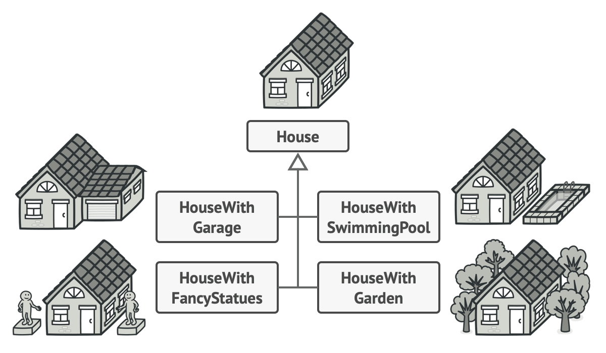

# Builder
The Builder pattern lets you construct complex objects step by step,
producing different types and representations of an object using the same construction code.

## ❌ Problems
1. **Giant constructor with multiple parameters:** A constructor with many parameters can become unwieldy, difficult to understand, and prone to error. Additionally, many parameters may remain unused in certain configurations.

2. **Subclasses for every combination:** Another wrong approach is to create a subclass for every possible combination of parameters. This can lead to a bloated class hierarchy and complex code maintenance.

3. **Rigidity in object creation:** In some cases, object creation may be tightly coupled with the object’s class, making it difficult to adjust object construction for different scenarios or representations.

## ✅ Solution
The Builder pattern offers a clean solution to these problems by separating the construction process from the object itself. It also organizes object construction into a set of steps and you don’t need to call all of the steps, but only those that are necessary for producing a particular configuration of an object.

- **Builder Class:** The Builder class encapsulates the logic for constructing an object step by step.

- **Product:** This is the complex object that is being built. The Builder pattern allows you to create different representations of the `Product` using the same construction steps.

## ⚖️ Pros and Cons

### PROs:
- **Separation of Concerns:** Keeps the construction logic separate from the object itself, leading to cleaner and more manageable code.
- **Flexibility:** Can create different variations or representations of an object using the same construction process.
- **Readability:** Allows a fluent interface, making object creation more intuitive and easy to follow.

### CONs:
- **Complexity:** The pattern introduces additional classes, which might add complexity for simple use cases. In scenarios where the object creation isn't complex, this can feel like overkill, introducing unnecessary overhead in both time and resources.

## 📌 Recap
Builder = Step-by-step construction + Flexibility

- Separates the construction of complex objects from the object itself

- Allows you to build different representations using the same process

- Provides a more maintainable and flexible object creation process
