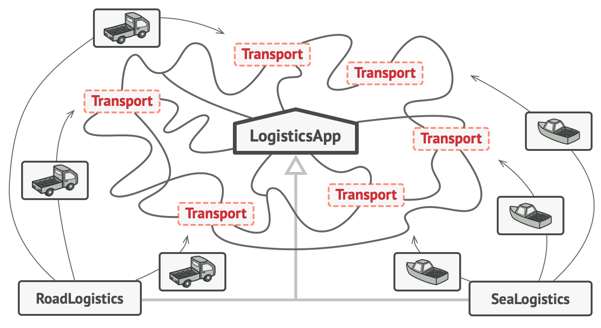

# Factory Method
The Factory Method design pattern defines an interface for creating objects, but allows subclasses to alter the type of objects that will be created.

## ❌ Problems
1. **Code duplication:** Object creation code might be duplicated in multiple places, violating the DRY principle.
2. **Extendibility:** Adding new product types often requires modifying existing code, breaking the Open/Closed Principle.
3. **Tight coupling:** Direct instantiation of objects creates tight coupling between the creator and concrete products.
4. **Hidden dependencies:** When instantiation is hard-coded, dependencies are not explicit, making the code less transparent.

## ✅ Solution
The Factory Method pattern addresses these issues by introducing a level of indirection between creators and products:

- **Product Interface:** Defines the common interface for objects the factory method creates.
- **Concrete Products:** Specific implementations of the Product interface.
- **Creator:** An abstract class or interface that declares the factory method, which returns a Product object.
- **Concrete Creators:** Subclasses that override the factory method to produce specific Concrete Products.

The pattern works by defining a method in the Creator class that returns a Product object, while letting subclasses decide which concrete class to instantiate. This way, client code works with Products through their common interface without being aware of the concrete implementation.

## ⚖️ Pros and Cons

### PROs:
- **Single Responsibility Principle:** Centralizes product creation code into one place, improving maintainability.
- **Open/Closed Principle:** Allows introducing new product types without breaking existing client code.
- **Loose coupling:** Client code depends on interfaces rather than concrete implementations.
- **Runtime flexibility:** Can return different products based on configuration or conditions.

### CONs:
- **Complexity:** Introduces additional classes and indirection. May be overkill for simple cases with few product variants.
- **Refactoring challenges:** Converting existing code to use Factory Method may require significant changes.
- **Parallel hierarchies:** Can create parallel class hierarchies that must be maintained together.

## 📌 Recap
Factory Method = Abstracted object creation + Subclass customization

- Defines an interface for creating objects, but lets subclasses decide which classes to instantiate

- Refers to newly created objects through a common interface

- Promotes loose coupling between client code and concrete product classes
