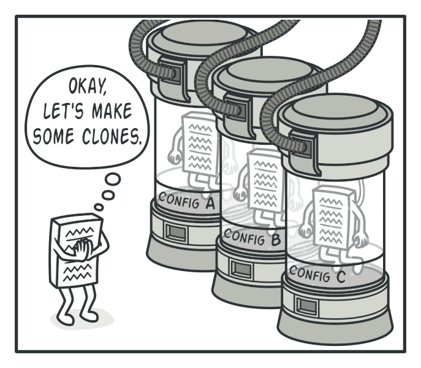

# Prototype
The Prototype pattern lets you copy existing objects without making your code dependent on their classes.

## ❌ Problems
1. **Expensive object creation:** Some objects require significant resources to create from scratch.
2. **Duplication:** When you need identical or slightly modified copies of complex objects, recreating them from scratch can be error-prone and tedious, especially if the object's internal state isn't fully accessible.
3. **Private constructors:** Sometimes you need to create instances of classes that have private constructors or that come from external libraries you can't modify.
4. **Maintainability:** In some cases you might create numerous subclasses just to represent different configurations of an object, leading to class explosion.
5. **Runtime flexibility**: Systems that need to create different object types at runtime without hardcoding class dependencies face challenges in maintaining flexibility.

## ✅ Solution
The Prototype pattern addresses these issues by creating new objects by copying existing ones, rather than constructing them from scratch.

- **Prototype Interface:** Declares the cloning method that concrete prototypes must implement.
- **Concrete Prototype:** Implements the cloning operation to create copies of itself.
- **Client:** Creates new objects by requesting a prototype to clone itself.

## ⚖️ Pros and Cons

### PROs:
- **Runtime flexibility:** The pattern lets you add or remove prototypes at runtime, allowing systems to evolve dynamically.
- **Reusability:** Creating objects by copying can be more efficient than creating them from scratch, especially for complex objects.
- **Internal state preservation:** When copying objects, their entire state (including private fields) is preserved, which might not be accessible through normal constructors.
- **Code complexity:** You can produce new objects without creating a hierarchy of creator classes and create pre-configured objects and clone them when needed, rather than configuring new instances each time.

### CONs:
- **Circular references:** Objects with circular references require special handling during cloning to avoid infinite loops.
- **Performance overhead:** For simple objects, creating a clone might be less efficient than creating a new instance directly.
- **Language limitations:** Some programming languages don't provide built-in cloning mechanisms, making implementation more difficult.

## 📌 Recap
Prototype = Object copying + Independence from concrete classes

- Creates new objects by copying existing ones instead of constructing from scratch

- Allows you to clone objects without coupling to their specific classes

- Provides flexibility to add or remove prototypes at runtime
