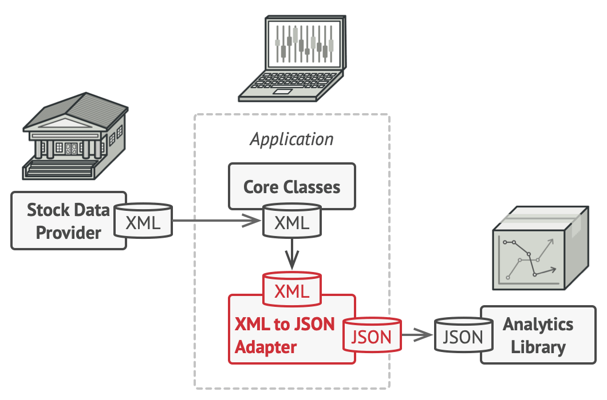

# Adapter
The Adapter pattern converts the interface of a class into another interface that clients expect. It allows classes with incompatible interfaces to work together by wrapping an instance of one class with a new adapter class.

## ❌ Problems
1. **Incompatibility:** Using a class that doesn't match the interface provided by the client code raises compatibility issues.
2. **Integration:** Integrating new code with legacy systems that cannot be modified raises integration problems.
3. **Third-Party Dependency:** Application often depends on external libraries with interfaces that don't align with the architecture used.
4. **Changing Requirements:** Interface requirements evolve over time, but modifying the original class would affect existing clients.

## ✅ Solution
The Adapter pattern acts as a bridge between incompatible interfaces by providing a wrapper that translates one interface to another. This allows objects that couldn't otherwise work together to collaborate.

- **Target Interface:** The interface that the client expects to work with.
- **Adaptee:** The class with useful functionality but incompatible interface.
- **Adapter:** The class that implements the target interface and translates calls to the adaptee.

There are two main implementation approaches:
- **Object Adapter:** Uses composition by containing an instance of the adaptee class.
- **Class Adapter:** Uses inheritance by extending the adaptee class.

When to use:
- Integrating with legacy systems
- Working with external libraries or APIs
- Supporting multiple interface versions
- Creating reusable components across different systems

## ⚖️ Pros and Cons

### PROs:
- **Single Responsibility Principle:** Separates interface conversion from business logic.
- **Open/Closed Principle:** Enables adding new adapters without changing existing code.
- **Reusability:** Makes legacy or third-party code reusable without modification.
- **Flexibility:** Allows client code to work with previously incompatible classes.
- **Testability:** Makes systems easier to test by providing standardized interfaces.

### CONs:
- **Complexity:** Introduces additional classes and indirection, increasing system complexity.
- **Performance:** May add slight performance costs due to the extra layer.
- **Over-adaptation:** Can lead to an abundance of adapter classes if overused.
- **Debugging:** Can make debugging more difficult due to the extra layer of abstraction.

## 📌 Recap
Adapter = Interface Conversion + Compatibility

- Acts as a translator between incompatible interfaces
- Enables integration of legacy or third-party code without modification
- Provides flexibility for evolving interface requirements
